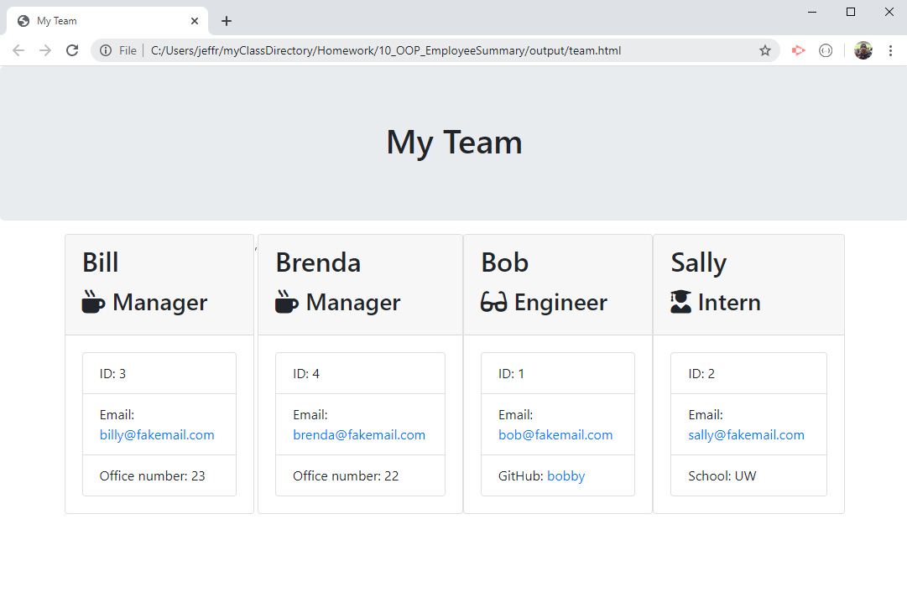

# Employee Summary Generator

Jeffrey Adamo  
UW Full Stack Coding Boot Camp  
[Employee Summary Generator](https://jeffreyadamo.github.io/10_OOP_EmployeeSummary/) at GitHub Pages  
  
***

## Description

This app uses node.js on the CLI to generate a html file containing a list of employees following a series of prompts. Select from 3 employee types (Manager, Engineer, Intern), and answer questions specific to each type. When finished, the app will produce "team.HTML" in the output folder to be displayed in the browser. A series of tests are included in the test folder. 

### User Story:
```
As a manager
I want to generate a webpage that displays my team's basic info
so that I have quick access to emails and GitHub profiles
```

### This application highlights the following features:
* node.js
* npm inquirer
* npm fs
* ES6 classes/subclasses
* ES6 module.export for clean file designations
* npm tests provided by UW Coding Boot Camp (unmodified)
* Placeholder HTML provided by UW Coding Boot Camp (unmodified):  
www.trilogyed.com

## Table of Contents

* [Installation](#installation)

* [Usage](#usage)

* [Contributing](#contributing)

* [Tests](#tests)

* [Questions/Contributions](#questions/contributions)

## Installation

Using the repository @  https://github.com/jeffreyadamo/10_OOP_EmployeeSummary.git

Run the following command to clone the repo in your desired destination folder:
```
git clone https://github.com/jeffreyadamo/10_OOP_EmployeeSummary.git
```
Please run the following command to install dependencies:

```
npm i
```

## Usage

After cloning from GitHub and installing dependencies, run "node app.js" and follow the prompts. Each employee has "name", "id", and "email" prompts, but each type of employee will ask additional questions. There is only one manager expected, so a confirmation prompt will be issued if more than one manager is added to the team. Look in the output folder for "team.html" when complete.

### For directions on how to run this application, click on the gif below to see a YouTube:

[](https://www.youtube.com/watch?v=Kldpa75Xnvg&feature=youtu.be)

### Upon completion of prompts, "team.html" will be generated in the output folder:




## Tests

### To run tests, run the following command:


```
npm test 
```
This will ensure each employee class can have its properties accessed. These can be found in the test folder.

## Contributing

Submit an issue or contact my GitHub

## Questions/Contributions

For further questions on this app, please open an issue or contact my GitHub  


    

@ [jeffreyadamo](http://www.github.com/jeffreyadamo)  
